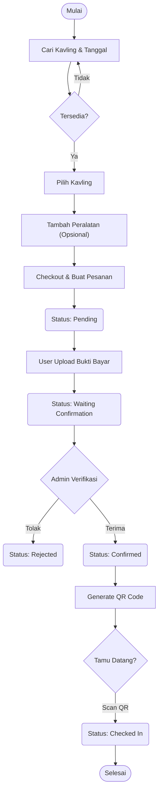
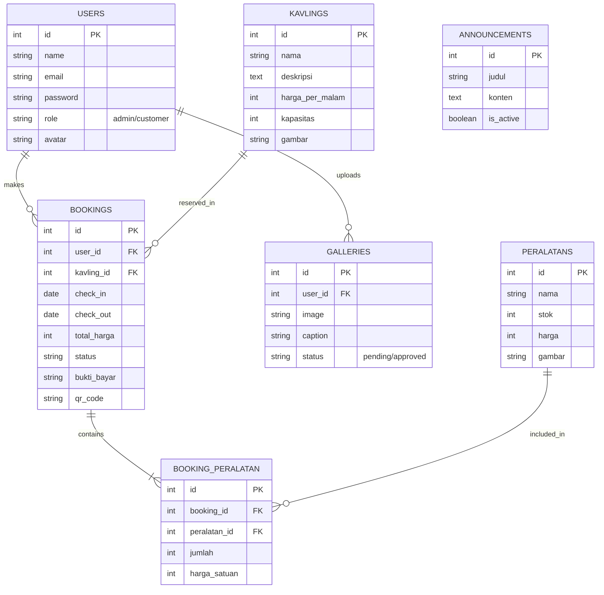

# Business Logic Documentation - LuhurCamp

## 1. Alur Sistem & Flowchart

### 1.1 Alur Pemesanan (Booking Flow)
Proses utama di mana pengguna melakukan reservasi kavling.
1.  **Cari & Pilih**: User memilih tanggal check-in/out. Sistem memfilter kavling yang tersedia.
2.  **Detail Pesanan**: User memilih peralatan tambahan (opsional).
3.  **Checkout**: User mengkonfirmasi pesanan. Status awal: `Pending`.
4.  **Pembayaran**: User melakukan transfer bank dan mengupload bukti bayar. Status berubah: `Waiting Confirmation`.
5.  **Verifikasi**: Admin mengecek mutasi rekening.
    *   Jika valid: Status `Confirmed` (QR Code terbit).
    *   Jika tidak valid: Status `Rejected`.
6.  **Check-in**: User datang ke lokasi, Admin scan QR Code. Status: `Checked In`.

#### Flowchart Booking

## 2. Entity Relationship Diagram (ERD)

Struktur database relasional LuhurCamp.

## 3. Dokumentasi API Endpoint

Berikut adalah daftar endpoint utama untuk integrasi Mobile App dan Backend.

### Authentication
| Method | Endpoint | Deskripsi |
| :--- | :--- | :--- |
| `POST` | `/api/v1/register` | Mendaftarkan pengguna baru. |
| `POST` | `/api/v1/login` | Login dan mendapatkan Bearer Token. |
| `POST` | `/api/v1/logout` | Menghapus token (Logout). |
| `GET` | `/api/v1/user` | Mendapatkan data profil user yang sedang login. |
| `PUT` | `/api/v1/user` | Memperbarui data profil (Nama, HP). |
| `POST` | `/api/v1/user/avatar` | Mengupload foto profil baru. |
| `POST` | `/api/v1/user/change-password` | Mengganti password. |

### Kavling
| Method | Endpoint | Deskripsi |
| :--- | :--- | :--- |
| `GET` | `/api/v1/kavlings` | List semua kavling. Mendukung param `start_date` & `end_date` untuk cek ketersediaan. |
| `GET` | `/api/v1/kavlings/{id}` | Detail kavling. |

### Peralatan
| Method | Endpoint | Deskripsi |
| :--- | :--- | :--- |
| `GET` | `/api/v1/peralatan` | List peralatan penyewaan. |

### Booking (Transaksi)
| Method | Endpoint | Deskripsi |
| :--- | :--- | :--- |
| `GET` | `/api/v1/bookings` | List riwayat booking user. |
| `POST` | `/api/v1/bookings` | Membuat booking baru. |
| `GET` | `/api/v1/bookings/{id}` | Detail booking tertentu. |
| `POST` | `/api/v1/bookings/{id}/upload-payment` | Mengupload bukti bayar. |
| `POST` | `/api/v1/bookings/{id}/cancel` | Membatalkan booking (hanya jika belum diproses). |

### Lainnya
| Method | Endpoint | Deskripsi |
| :--- | :--- | :--- |
| `GET` | `/api/v1/galleries` | List foto galeri. |
| `POST` | `/api/v1/galleries` | User upload foto ke galeri. |
| `GET` | `/api/v1/announcements` | List pengumuman aktif. |
| `GET` | `/api/v1/weather` | Data cuaca terkini (jika terintegrasi). |

## 4. Logika Bisnis Tambahan

### 4.1 Logika Ketersediaan (Availability Check)
**Metode**: Date Range Overlap.
Sebuah kavling `K` tidak tersedia pada rentang `[Start, End]` jika ada booking lain di kavling `K` dengan rentang `[B_Start, B_End]` dimana:
`(Start < B_End) AND (End > B_Start)`
Dan status booking tersebut bukan `Cancelled` atau `Rejected`.

### 4.2 Alur Verifikasi Pembayaran
1.  User upload bukti bayar -> Status `Waiting Confirmation`.
2.  Admin melihat dashboard -> muncul notifikasi "Perlu Verifikasi".
3.  Admin cek mutasi bank.
    *   **Cocok**: Klik "Terima" -> Status `Confirmed`. System generate QR Code.
    *   **Tidak Cocok**: Klik "Tolak" -> Status `Rejected`. System kirim alasan penolakan.

### 4.3 Logika Check-in
-   Hanya booking dengan status `Confirmed` yang bisa Check-in.
-   Check-in hanya bisa dilakukan pada tanggal `>= Tanggal Check-in`.
-   Admin scan QR Code atau input kode booking.
-   Sistem memvalidasi dan mengubah status menjadi `Checked In`.
